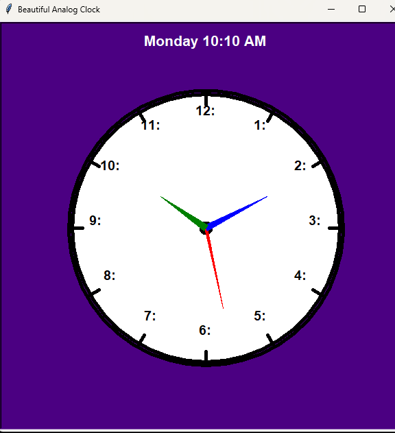

Experience time in a visually engaging way with our Turtle-based analog clock. This interactive clock displays the current time, including hours, minutes, seconds, AM/PM, and the day of the week, all beautifully illustrated using Python's Turtle graphics.

# Turtle Clock

This is a Python Turtle-based analog clock that displays the current time, including hours, minutes, seconds, AM/PM, and the day of the week. The clock is beautifully illustrated using Python's Turtle graphics.

## Features

- Analog clock display
- Shows hours, minutes, and seconds
- Displays AM/PM
- Shows the current day of the week

## Requirements

- Python 3 or greater
- Turtle graphics module (included with Python's standard library)(default)

## Usage

1. Clone the repository:
   ```bash
   git clone https://github.com/indala/Clock.git


